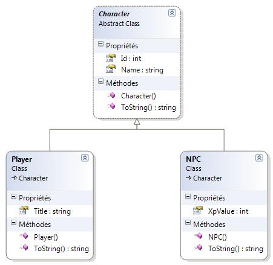
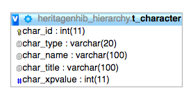
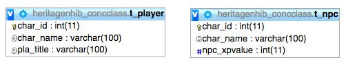
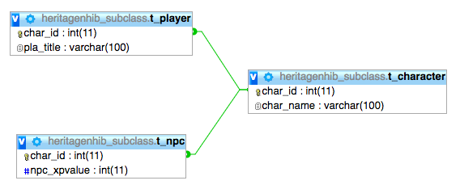

# HeritageNHibernate



Chacun des trois projets implémente une stratégie de mapping de la même hiérarchie de classes dans une base de données relationnelle. 

Chaque stratégie a ses avantages et ses inconvénients. Le choix de la meilleure stratégie dépend du contexte et notamment de la quantité de propriétés communes aux classes.

## Une table pour toute la hiérarchie



```xml
<class name="Character" table="t_character" abstract="true">
    <id name="Id" column="char_id" type="int">
        <generator class="native">
        </generator>
    </id>
    <discriminator column="char_type" type="String" />
    <property name="Name" column="char_name" />
    <subclass name="Player" discriminator-value="PLA">
        <property name="Title" column="char_title" />
    </subclass>
    <subclass name="NPC" discriminator-value="NPC">
        <property name="XpValue" column="char_xpvalue" />
    </subclass>
</class>
```

## Une table par classe concrète



```xml
<class name="Character" abstract="true">
    <id name="Id" column="char_id" type="int">
        <generator class="increment">
        </generator>
    </id>
    <property name="Name" column="char_name" />
    <union-subclass name="Player" table="t_player">
        <property name="Title" column="pla_title" />
    </union-subclass>
    <union-subclass name="NPC" table="t_npc">
        <property name="XpValue" column="npc_xpvalue" />
    </union-subclass>
</class>
```

## Une table par sous-classe (aka une table par type)



```xml
<class name="Character" table="t_character" abstract="true">
    <id name="Id" column="char_id" type="int">
        <generator class="native">
        </generator>
    </id>
    <property name="Name" column="char_name" />
    <joined-subclass name="Player" table="t_player">
        <key column="char_id" />
        <property name="Title" column="pla_title" />
    </joined-subclass>
    <joined-subclass name="NPC" table="t_npc">
        <key column="char_id" />
        <property name="XpValue" column="npc_xpvalue" />
    </joined-subclass>
</class>
```
